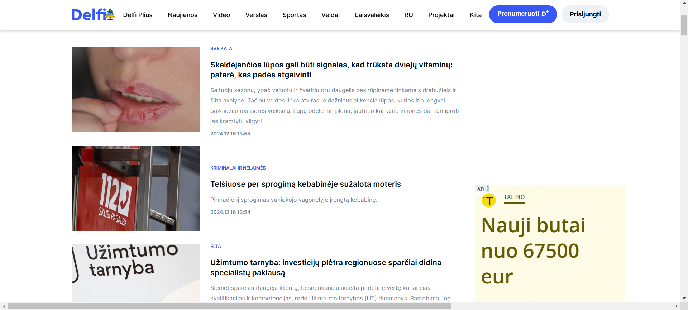
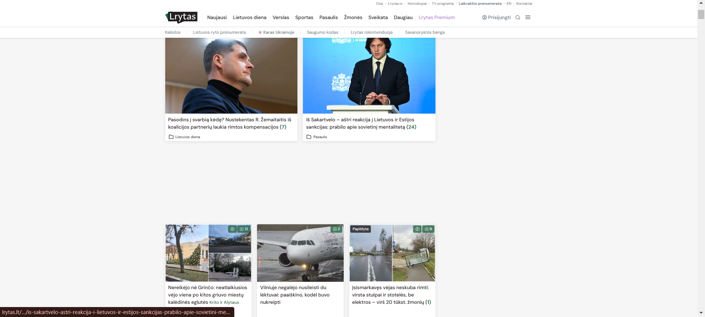
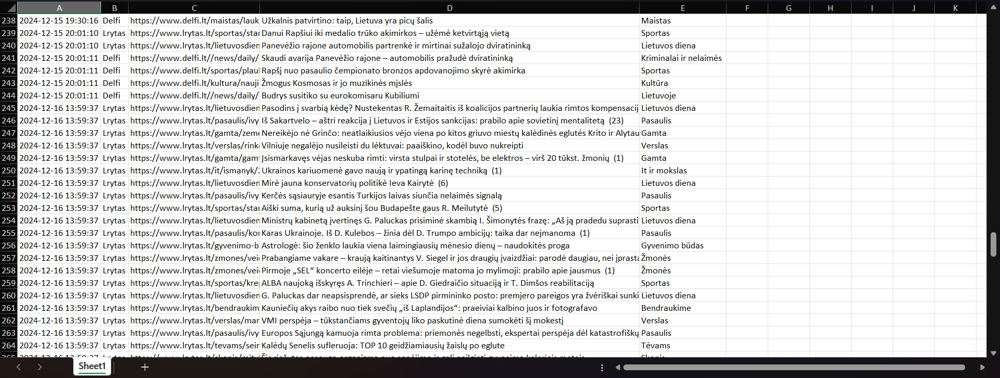
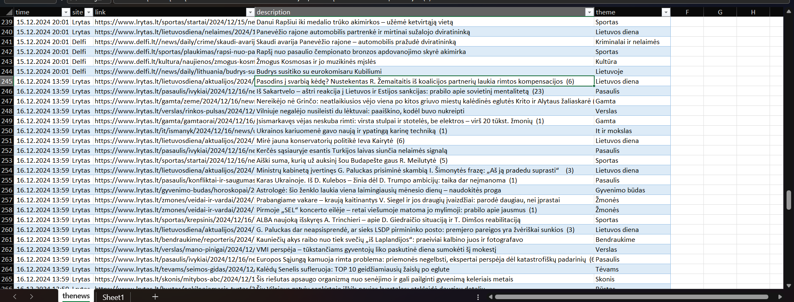

# News Scraper

## Project Overview
The **News Scraper** is a Python-based web scraping project designed to collect and organize news articles from two popular Lithuanian news websites: [Lrytas](https://www.lrytas.lt) and [Delfi](https://www.delfi.lt). The scraper extracts key details about the latest news, such as publication time, headline, theme, and URL, and saves the data into Excel and CSV files. It runs periodically to ensure up-to-date information.

## Features
- Scrapes news articles from **Lrytas** and **Delfi** websites.
- Extracts:
  - Publication time
  - News headline
  - Article link
  - News theme
- Saves data to:
  - Excel file (`thenews.xlsx`)
  - CSV file (`thenews.csv`)
- Prevents duplication by checking for existing links in the data.
- Runs automatically at intervals (default: every 10 minutes).

## Technologies Used
- **Python**: Core language
- **BeautifulSoup** (with lxml): For HTML parsing
- **Requests**: For sending HTTP requests
- **Pandas**: For data manipulation
- **Datetime**: For handling timestamps
- **OpenPyXL**: For working with Excel files
- **CSV**: For handling CSV file output

## How It Works
The project operates in the following steps, with key elements of the code explained:

### 1. Importing Libraries
```python
import datetime
from bs4 import BeautifulSoup
import lxml
import requests
import csv
import pandas as pd
import re
import time
```
- `datetime`: To generate the current timestamp for each news item.
- `BeautifulSoup` and `lxml`: For parsing the HTML structure of the webpages.
- `requests`: To send HTTP GET requests to the news websites.
- `csv` and `pandas`: For saving and manipulating scraped data.
- `time`: To implement periodic execution of the scraper.

### 2. Define Global Variables
```python
url_lrytas = "https://www.lrytas.lt"
url_delfi = "https://www.delfi.lt/paieska"

headers = {
    "Accept": "*/*",
    "User-Agent": "Mozilla/5.0 (Windows NT 10.0; Win64; x64) AppleWebKit/537.36 (KHTML, like Gecko) Chrome/131.0.0.0 Safari/537.36"
}

data = []
```
- `url_lrytas` and `url_delfi`: URLs of the websites to scrape.
- `headers`: Custom HTTP headers to mimic a browser request.
- `data`: List to store the scraped news items temporarily.

### 3. Scraping News from Lrytas
```python
def get_news_lrytas(url):
    try:
        req = requests.get(url, headers=headers)
        req.raise_for_status()
        src = req.text
    except requests.exceptions.RequestException as ex:
        print(f"Error fetching Lrytas: {ex}")
        return

    soup = BeautifulSoup(src, "lxml")

    divs_to_remove = soup.find_all("div", class_="mb-9")
    if len(divs_to_remove) >= 3:
        divs_to_remove[-3].decompose()

    div_blocks = soup.find_all("div", class_="rounded-[4px] h-full flex relative shadow-base bg-white flex-col")

    for item in div_blocks:
        current_time = datetime.datetime.now().strftime('%Y-%m-%d %H:%M:%S')
        href = item.find("a").get("href")
        full_href = "https://www.lrytas.lt" + href
        text = item.find("h2").text
        theme = item.find("span", class_="text-xs ml-1.5").text

        record = {
            "time": current_time,
            "site": "Lrytas",
            "link": full_href,
            "description": text,
            "theme": theme
        }
        data.append(record)
```
- Sends an HTTP GET request to the Lrytas homepage and parses the response.
- Removes irrelevant div elements to clean up the HTML.
- Extracts the news link, headline, and theme, and records the current timestamp.
- Appends each news item to the `data` list.

### 4. Scraping News from Delfi
```python
def get_news_delfi(url):
    try:
        req = requests.get(url, headers=headers)
        req.raise_for_status()
        src = req.text
    except requests.exceptions.RequestException as ex:
        print(f"Error fetching Delfi: {ex}")
        return

    soup = BeautifulSoup(src, "lxml")

    div_block = soup.find("div", attrs={"data-container": "articles-container"}).find_all("div", class_="col-12")

    for item in div_block:
        current_time = datetime.datetime.now().strftime('%Y-%m-%d %H:%M:%S')
        href = item.find("a").get("href")
        if href.startswith("/"):
            href = "https://www.delfi.lt" + href
        text = item.find("h5", class_="headline-title headline-title--size-h4 headline-title--size-sm-h6").text
        theme = item.find("div", class_="headline-labels__label").text.strip()

        record = {
            "time": current_time,
            "site": "Delfi",
            "link": href,
            "description": text,
            "theme": theme
        }
        data.append(record)
```
- Similar to `get_news_lrytas`, but tailored to the Delfi website's structure.
- Adjusts relative URLs to absolute ones.

### 5. Combining and Saving Data
```python
def get_data():
    get_news_lrytas(url_lrytas)
    get_news_delfi(url_delfi)

    new_dp = pd.DataFrame(data)
    existing_data = pd.read_excel("data/thenews.xlsx")
    old_dp = pd.DataFrame(existing_data)

    if not existing_data.empty:
        new_news = new_dp[~new_dp["link"].isin(existing_data["link"])]
    else:
        new_news = new_dp

    combined_data = pd.concat([old_dp, new_dp]).drop_duplicates(subset=["link"], keep="first")
    combined_data.to_excel("data/thenews.xlsx", index=False)
    combined_data.to_csv("data/thenews.csv", index=False)

    print("New news")
    print(new_news)
```
- Converts the scraped data to a Pandas DataFrame.
- Loads existing data from `thenews.xlsx` and compares it to find new articles.
- Combines old and new data, removes duplicates, and saves it back to Excel and CSV files.

### 6. Running Periodically
```python
while True:
    get_data()
    time.sleep(600)
```
- Calls the `get_data` function in an infinite loop with a delay of 600 seconds (10 minutes).

### Project Files

main.py: The main script for scraping and data handling.

thenews.xlsx: The Excel file containing all scraped news.

thenews.csv: The CSV file with the same data as the Excel file.

delfi_new.html: Cached HTML source of the Delfi website (optional).

lrytas_new.html: Cached HTML source of the Lrytas website (optional).

Delfi_screenshot.png: Screenshot of the Delfi website.

Lrytas_screenshot.png: Screenshot of the Lrytas website.

csv_screenshot.png: Screenshot of the CSV file.

excel_screenshot.png: Screenshot of the Excel file.

### Screenshots

Delfi Website


Lrytas Website


Excel File Output


CSV File Output

